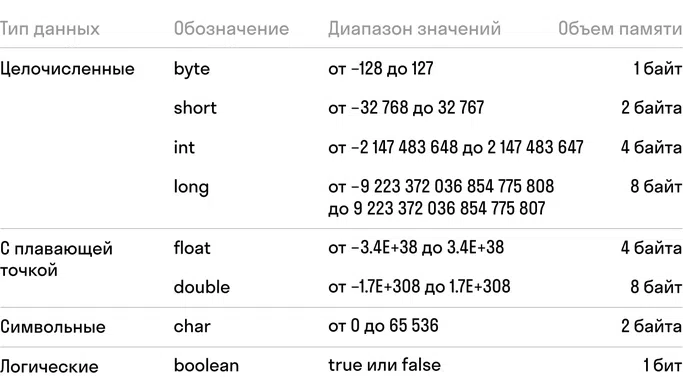

## Условия домашки

---
### Задача 1
Объявите переменные типа int, byte, short, long, float, double.

Название переменных может быть любым, но если состоит из двух слов и более, должно соответствовать правилу camelCase.

Выведите в консоль значение каждой переменной в формате «Значение переменной … с типом … равно …».
<details>
  <summary>Подсказка</summary>



Примеры инициализации переменных
```java
int a = 40000;
byte b = 22;
float с = 3.75f;
```
</details>
<details>
  <summary>Критерии оценки</summary>

- Объявили типы переменных int, byte, short, long, float, double.
- Назвали переменные согласно правилам Java.
- Соблюдаются правила пунктуации.
- Вывели значения всех переменных в консоль.
</details>

---
### Задача 2
Ниже дан список различных значений. Инициализируйте переменные, используйте изученные ранее типы переменных.

Значения:
- 27.12
- 987 678 965 549
- 2,786
- 569
- -159
- 27897
- 67
<details>
  <summary>Критерии оценки</summary>

- Перечислили все типы переменных.
- Корректно присвоили значения типам переменных.
- Корректно инициализировали все переменные (включая спецсимволы после значений для long и float).
</details>

---
### Задача 3
Три школьных учителя, Людмила Павловна, Анна Сергеевна и Екатерина Андреевна, ведут три класса.

У Людмилы Павловны — 23 ученика , у Анны Сергеевны — 27 учеников, у Екатерины Андреевны — 30 учеников.

Три учительницы закупили все вместе 480 листов бумаги на все три класса. Посчитайте, сколько достанется листов каждому ученику.

Результат задачи выведите в консоль в формате: «На каждого ученика рассчитано … листов бумаги».

Для объявления переменных не используйте тип var.
<details>
  <summary>Критерии оценки</summary>

- Корректно использовали типы переменных.
- В решении не использовали тип переменной var.
- Назвали переменные согласно правилам Java.
- Соблюдаются правила пунктуации.
- Решение задания вывели в консоль.
</details>

---
### Задача 4
Производительность машины для изготовления бутылок — 16 бутылок за 2 минуты. Какая производительность машины будет:

- за 20 минут,
- в сутки,
- за 3 дня,
- за 1 месяц?

Рассчитывайте производительность работы машины в том случае, если она работает без перерыва заданный промежуток времени.

Результаты подсчетов выведите в консоль в формате: «За … машина произвела … штук бутылок».

Для объявления переменных не используйте тип var.
<details>
  <summary>Критерии оценки</summary>

- Корректно использовали типы переменных.
- В решении не использовали тип переменной var.
- Переменные назвали согласно правилам Java.
- Соблюдаются правила пунктуации.
- Решение задания вывели в консоль.
</details>

---
### Задача 5
На ремонт школы нужно 120 банок краски двух цветов: белой и коричневой. На один класс уходит 2 банки белой и 4 банки коричневой краски. Сколько банок каждой краски было куплено?

Выведите результат задачи в консоль в формате: «В школе, где … классов, нужно … банок белой краски и … банок коричневой краски».

Для объявления переменных не используйте тип var.
<details>
  <summary>Критерии оценки</summary>

- Корректно использовали типы переменных.
- В решении не использовали тип переменной var.
- Переменные назвали согласно правилам Java.
- Соблюдаются правила пунктуации.
- Решение задания вывели в консоль.
</details>

---
### Задача 6
Спортсмены следят за своим весом и тщательно относятся к тому, что и сколько они съедают.

Вот один из рецептов, по которому спортсмен готовит себе завтрак:

- Бананы — 5 штук (1 банан — 80 грамм).
- Молоко — 200 мл (100 мл = 105 грамм).
- Мороженое-пломбир — 2 брикета по 100 грамм.
- Яйца сырые – 4 яйца (1 яйцо — 70 грамм).
- Смешать всё в блендере — и готово.

Подсчитайте вес (количество граммов) такого спортзавтрака, а затем переведите его в килограммы.

Результат в граммах и килограммах напечатайте в консоль.
>Важное условие: если в рецепт нужно добавить несколько единиц какого-то продукта (с определенным весом), то нужно умножать количество единиц на вес в граммах. Например, если в рецепте указано, что нужно добавить 5 бананов по 80 грамм, то нужно количество бананов (5) умножить на вес одного (80 грамм), а не считать самим общую сумму граммов.
<details>
  <summary>Критерии оценки</summary>

- Корректно использовали типы переменных.
- В решении не использовали тип переменной var.
- Переменные назвали согласно правилам Java.
- Соблюдаются правила пунктуации.
- Решение задания вывели в консоль.
</details>

---
### Задача 7
Правила соревнований обновились, и спортсмену, чтобы оставаться в своей весовой категории, нужно сбросить 7 кг. Тренер скорректировал рацион так, чтобы спортсмен мог терять в весе от 250 до 500 грамм в день.

Посчитайте, сколько дней уйдет на похудение, если спортсмен будет терять каждый день по 250 грамм, а сколько — если каждый день будет худеть на 500 грамм.

Посчитайте, сколько может потребоваться дней в среднем, чтобы добиться результата похудения.

Результаты всех подсчетов выведите в консоль.
<details>
  <summary>Критерии оценки</summary>

- Корректно использовали типы переменных.
- В решении не использовали тип переменной var.
- Переменные назвали согласно правилам Java.
- Операцию деления выполнили верно.
- Соблюдаются правила пунктуации.
- Решение задания вывели в консоль.
</details>

---
### Задача 8
Представим, что мы работаем в большой компании, штат которой состоит из нескольких сотен сотрудников. В компании есть правило: чем дольше сотрудник работает в компании, тем ценнее он для бизнеса. Поэтому сотрудники, которые работают в компании дольше 3 лет, получают повышение зарплаты раз в год. Каждый год повышение составляет 10% от текущей зарплаты.

К вам пришел руководитель с задачей автоматизировать повышение зарплаты, а также провести расчет для следующих сотрудников:

- Маша получает 67 760 рублей в месяц.
- Денис получает 83 690 рублей в месяц.
- Кристина получает 76 230 рублей в месяц.

Каждому нужно увеличить зарплату на 10% от текущей месячной. Дополнительно руководитель попросил посчитать разницу между годовым доходом с нынешней зарплатой и после повышения.

Посчитайте, сколько будет получать каждый из сотрудников, а также разницу между годовым доходом до и после повышения.

Выведите в консоль информацию по каждому сотруднику. Например: «Маша теперь получает ... рублей. Годовой доход вырос на ... рублей».
<details>
  <summary>Критерии оценки</summary>

- Корректно использовали типы переменных.
- Операцию умножения выполнили верно.
- Операцию сложения выполнили верно.
- Все условия задания выполнили.
</details>

---
### Часто спрашивают
<details>
  <summary>Вопрос</summary>

В задаче 6 не понимаю, какой тип оператора нужен, чтобы граммы перевести в килограммы.
<details>
  <summary>Ответ</summary>

Просто делим на 1000.
```java
int grPerKg = 1000;
float weightKg = weightGr/(float)grPerKg;
```
</details>
</details>