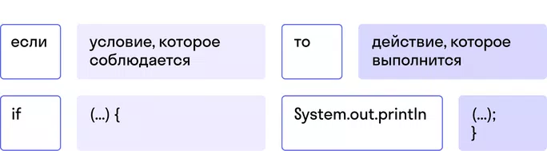

## Условия домашки

---
### Задача 1
С помощью условного оператора напишите программу, которая выводит в консоль:
- сообщение о том, что человеку 18 или больше лет;
- сообщение, что возраст совершеннолетия еще не наступил, нужно немного подождать.

При выполнении каждого условия программа должна выводить в консоль сообщение в формате: «Если возраст человека равен …, то (вывести в зависимости от результата) он совершеннолетний / он не достиг совершеннолетия, нужно немного подождать».
<details>
  <summary>Критерии оценки</summary>

- Инициализировали переменные.
- Имя переменных отражает данные, которые они содержат.
- Параметры условного оператора решают задание.
- Решение задачи выводится в консоль.
</details>
<details>
  <summary>Подсказка</summary>


</details>

---
### Задача 2
Человек одевается в зависимости от температуры воздуха. Напишите программу, которая выводит сообщение:
- «На улице холодно, нужно надеть шапку» — если температура ниже 5 градусов.
- «Сегодня тепло, можно идти без шапки» — если температура воздуха выше 5 градусов.

При выполнении каждого условия выведите в консоль: «На улице … градусов, (вывести в зависимости от результата) нужно надеть шапку / можно идти без шапки».
<details>
  <summary>Критерии оценки</summary>

- Инициализировали переменные.
- Имя переменных отражает данные, которые они содержат.
- Параметры условного оператора решают задание.
- Решение задачи выводится в консоль.
</details>

---
### Задача 3
За превышение скорости водителю могут выписать штраф. Напишите программу, которая сообщает водителю о том, что:
- скорость превышена, если она больше 60 км/ч;
- превышения скорости нет, если она меньше 60 км/ч.

При выполнении каждого условия программа должна выводить такое сообщение: «Если скорость …, то (вывести в зависимости от результата) придется заплатить штраф / можно ездить спокойно».
<details>
  <summary>Критерии оценки</summary>

- Инициализировали переменные.
- Имя переменных отражает данные, которые они содержат.
- Параметры условного оператора решают задание.
- Решение задачи выводится в консоль.
</details>

---
### Задача 4
Напишите программу, которая помогает определить, в какое учреждение нужно отправить человека в зависимости от его возраста:
- Если человеку от 2 до 6 лет, то ему нужно ходить в детский сад.
- Если человеку от 7 до 17 лет, то ему нужно ходить в школу.
- Если человеку больше или равно 18 лет, но меньше или равно 24, то его место в университете.
- А если человеку больше 24, то ему пора ходить на работу.

При выполнении каждого условия программа должна выводить в консоль сообщение в формате: «Если возраст человека равен …, то ему нужно ходить … (в зависимости от возраста дописать нужное)».
<details>
  <summary>Критерии оценки</summary>

- Инициализировали переменные.
- Имена переменных отражают данные, которые содержат.
- Параметры условного оператора решают задание.
- Решение задачи выводится в консоль.
</details>

---
### Задача 5
Как правило, на аттракционах действуют ограничения для детей по возрасту:
- Если ребенку меньше 5 лет, то он не может кататься на аттракционе.
- Если ребенку больше 5, но меньше 14 лет, то он может кататься только в сопровождении взрослого. Если взрослого нет, то кататься нельзя.
- Если ребенок старше 14 лет, то он может кататься без сопровождения взрослого.

Напишите программу, которая выводит в консоль сообщение в формате: «Если возраст ребенка равен …, то ему … (в зависимости от возраста дописать нужное: нельзя кататься на аттракционе, можно кататься на аттракционе в сопровождении / без сопровождения взрослого)».
<details>
  <summary>Критерии оценки</summary>

- Инициализировали переменные.
- Имена переменных отражают данные, которые содержат.
- Параметры условного оператора решают задание.
- Решение задачи выводится в консоль.
- Для решения использовали конструкцию else.
</details>

---
### Задача 6
Вместимость одного вагона поезда — 102 человека. Вагон рассчитан на 60 сидячих мест, все остальные — стоячие.

С помощью условного оператора и конструкции else напишите программу, которая выводит в консоль сообщение о том, есть ли место в вагоне, сидячее или стоячее, или вагон уже полностью забит.
<details>
  <summary>Критерии оценки</summary>

- Инициализировали переменные.
- Имена переменных отражают данные, которые содержат.
- Параметры условного оператора решают задание.
- Решение задачи выводится в консоль.
- Для решения использовали конструкцию else.
</details>

---
### Задача 7
Даны три числа:
```java
int one;  
int two;
int three;
```
С помощью условного оператора и конструкции else напишите программу, которая вычисляет, какое из трех чисел бо́льшее, и выводит результат в консоль.
<details>
  <summary>Критерии оценки</summary>

- Инициализировали переменные.
- Параметры условного оператора решают задание.
- Решение задачи выводится в консоль.
- Для решения использовали конструкцию else.
</details>