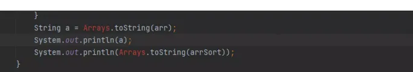

## Условия домашки

---
### Задача 1
Объявите три массива:
- Целочисленный массив, заполненный тремя цифрами — 1, 2 и 3 — с помощью ключевого слова
```new```.
<details>
  <summary>Подсказка</summary>

Объявление массива из 12 элементов, заполненного нулями:

```int [] weight = new int [12];```
</details>

- Массив, в котором можно хранить три дробных числа — 1.57, 7.654, 9.986. Массив сразу заполните значениями.
<details>
  <summary>Подсказка</summary>

Объявление целочисленного массива, заполненного 12 элементами:

```int [] weight = {90, 91, 93, 92, 85, 87, 84, 83, 0, 0, 0, 0};```
</details>

- Произвольный массив. Тип и количество данных определите сами. Самостоятельно выберите способ создания массива: с помощью ключевого слова или сразу заполненный элементами.

<details>
  <summary>Критерии оценки</summary>

- Целочисленный массив создали с помощью ключевого слова new.
- Создали массив с дробными числами и сразу заполнили его значениями.
- Создали любой произвольный массив одним из двух способов, рассмотренных в уроке.
</details>

---
### Задача 2
Распечатайте на отдельной строчке элементы каждого массива по порядку через запятую. В конце строки запятую ставить не надо.
<details>
  <summary>Критерии оценки</summary>

- В консоль вывели все элементы первого массива в верном порядке через запятую.
- В консоль вывели все элементы второго массива в верном порядке через запятую.
- В консоль вывели все элементы третьего массива в верном порядке через запятую.
- На одной строчке расположены элементы только одного массива.
</details>

---
### Задача 3
Распечатайте на отдельной строчке элементы каждого массива в обратном порядке через запятую. В конце строки запятую ставить не надо.

Если в задаче 2 в консоль у вас вывелся результат:
```
1, 2, 3
1.57, 7.654, 9.986
// Произвольные элементы третьего массива
```

то в этой задаче результат должен быть таким:
```
3, 2, 1
9.986, 7.654, 1.57
// Произвольные элементы третьего массива в обратном порядке
```
<details>
  <summary>Критерии оценки</summary>

- В консоль вывели все элементы первого массива в верном порядке через запятую.
- В консоль вывели все элементы второго массива в верном порядке через запятую.
- В консоль вывели все элементы третьего массива в верном порядке через запятую.
- На одной строчке расположены элементы только одного массива.
</details>

---
### Задача 4
Пройдитесь по первому целочисленному массиву и все нечетные числа в нем сделайте четными (нужно прибавить 1).

__Важно:__ код должен работать с любым целочисленным массивом, поэтому для решения задания используйте циклы.

Распечатайте результат преобразования в консоль.
<details>
  <summary>Подсказка</summary>

Если формат вывода элементов массива в консоль не важен, то распечатайте элементы массива с помощью метода
```Arrays.toString ()```.

Для этого после объявления и инициализации массива напишите команду
```System.out.println```, внутри нее —
```Arrays.toString```, в круглых скобках которого укажите имя массива:
```
int [] arr = {1, 2, 3};
System.out.println(Arrays.toString(arr));
```
Метод выводит элементы массива одной строчкой через запятую в квадратных скобках:

```[1, 2, 3]```

Подробнее о методе
```Arrays.toString```
рассказывается в конспекте.
</details>
<details>
  <summary>Критерии оценки</summary>

- В целочисленном массиве все элементы — четные числа.
- В консоли распечатали только целочисленный массив.
</details>

---
### Часто спрашивают
<details>
  <summary>Вопрос</summary>

Что делать, если при работе с методом
```Arrays.toString ()```, IDEA выделяет```Arrays```красным?

<details>
  <summary>Ответ</summary>

Если у вас возникла такая проблема, нужно навести на красное и нажать Alt + Enter или прописать в самом верху файла, над строкой с class, но ниже строки package, следующее:

```import java.util.Arrays;```
</details>
</details>