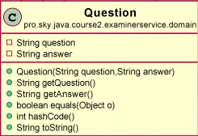
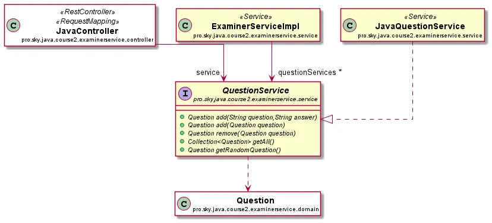
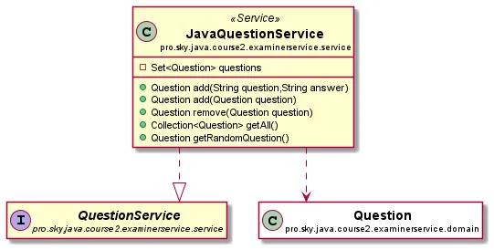
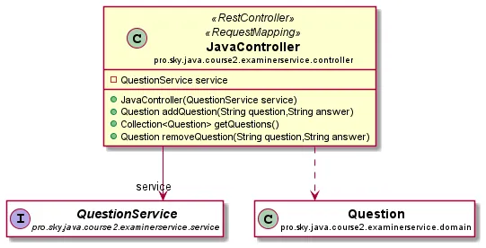
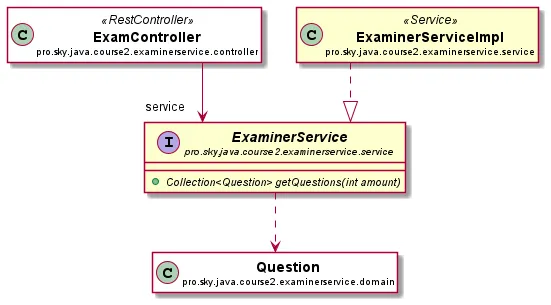
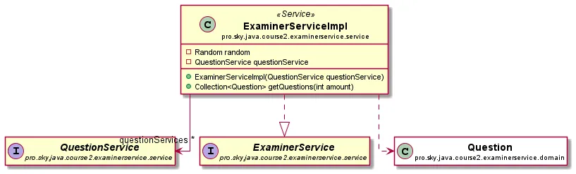
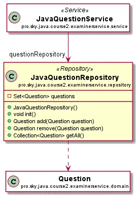

## Курсовая работа 2-го курса

---
В курсовой работе ко второму курсу вам необходимо реализовать приложение, которое будет генерировать вопросы к экзамену.

#### Путь пользователя:

1. Пользователь обращается к некому эндпоинту по адресу (”/exam/get/{amount}”)
1. Пользователь получает ответ в виде списка случайных вопросов-ответов, количество которых равно amount из прошлого
   шага
1. Пользователь должен иметь возможность добавить, получить и удалить вопросы из хранилища вопросов (”/exam/java/(
   add/remove/find)”)

  
L1. Примитивный уровень

Для упрощения архитектурного понимания, вам будут даны подсказки по организации проекта.

1. Реализовать сущность Question с двумя полями: question и answer. Данная сущность будет использоваться в качестве
   хранителя данных по вопросу.
    

      
Архитектура

   
    

1. Сделать интерфейс QuestionService, который будет содержать в себе все методы по работе с вопросами определенного
   предмета.
    

      
Архитектура

   
    

1. Реализовать сервис JavaQuestionService, который будет реализовывать QuestionService и хранить в себе список вопросов
   по Java, а также осуществлять всю работу с этим списком.

   Реализация метода getRandomQuestion осуществляется с помощью класса Random и его метода nextInt, который в качестве
   параметра принимает максимальное число, а затем возвращает вам результат в виде случайного числа от 0 до
   максимального числа из параметров (не включительно).
    

      
Архитектура

   
    

1. Реализовать контроллер JavaQuestionController, который будет предоставлять возможность пользователю добавлять,
   просматривать и удалять вопросы по Java в соответствующем QuestionService.

   Контроллер должен иметь три метода: добавить, удалить и получить все вопросы.

   Эти методы должны висеть на следующих эндпоинтах:

   Добавить: “/exam/java/add?question=QuestionText&answer=QuestionAnswer”

   Удалить: “/exam/java/remove?question=QuestionText&answer=QuestionAnswer”

   Получить все вопросы: “/exam/java”
    

      
Архитектура

   
    

1. Сделать интерфейс ExaminerService с одним методом getQuestions.

   Этот интерфейс должен содержать один метод, который вернет список вопросов.
    

      
Архитектура

   
    

1. Реализовать ExaminerServiceImpl, который является реализацией интерфейса из прошлого шага. Данный сервис должен
   внутри себя хранить поля типа QuestionService.

   Его задача: создать коллекцию и заполнить её с помощью вызова getRandomQuestion у QuestionService случайными
   вопросами.

   Учтите:

    1. Вопросы должны быть уникальные, следовательно, для получения 5 вопросов может потребоваться более 5 вызовов
       метода getRandomQuestion сервиса вопросов.
    1. Если запрошено большее количество вопросов, чем хранится в сервисе, нужно выкинуть исключение. Для этого,
       соответственно, нужно написать свое исключение со статусом BAD_REQUEST.
    

      
Архитектура

   
    

7. Реализовать контроллер ExamController с одним методом getQuestions(int amount).

   Контроллер должен обратиться к ExaminerService, получить от сервиса коллекцию вопросов и вернуть пользователю.

8. Покрыть юнит-тестами JavaQuestionService и ExaminerServiceImpl (потребуется мок).

  
Критерии оценки 

- Использованы все методы, указанные в архитектуре
- В написании кода используется правильное форматирование
- DI создан с использованием конструктора
- Юнит-тестами покрыты JavaQuestionService и ExaminerServiceImpl
- Метод getRandomQuestion не обязательно покрыт юнит-тестами
- В коллекциях нет двух вопросов, у которых вопрос-ответ имеет одинаковое значение (поля q и a имеют одинаковое
  значение)
- Будет плюсом: в коллекциях указаны только уникальные вопросы

  
L2. Упрощённый уровень

1. Реализовать ещё одну реализацию для QuestionService, а именно MathQuestionService.

   Данный сервис должен работать по аналогии с JavaQuestionService, но с математическими примерами.

1. Реализовать контроллер MathQuestionController, который позволяет добавлять, удалять и получать список математических
   вопросов. Для получения конкретной реализации интерфейса QuestionService может потребоваться аннотация @Qualifier.
1. Перенести функцию хранение вопросов из сервисов в отдельные сущности — репозитории. Для этого потребуется реализовать
   интерфейс QuestionRepository с методами add, remove и getAll. А затем написать две реализации для вопросов по Java и
   по математике.

   Эти сущности нужно заинжектить в соответствующие сервисы и в сервисах “дергать” репозиторий в случае необходимости
   добавления, удаления и получения вопросов.

   Допустимо также реализовать @PostConstruct метод init, который заполнит репозиторий данными сразу после его создания
   Spring.
    

      
Архитектура

   
    

1. Доработать ExaminerService на получение случайного набора вопросов не только из JavaQuestionService, но и из
   MathQuestionService. Включать в запрос вопросы не только по джаве, но и по математике. Количество вопросов по каждой
   из тем выбирать случайно. Для получения конкретной реализации интерфейса QuestionService может потребоваться
   аннотация @Qualifier.
1. Доработать JavaQuestionController, так как вторая реализация QuestionService сломала корректный инжект по интерфейсу.
   Может потребоваться аннотация @Qualifier.
1. Покрыть юнит-тестами MathQuestionService (с моком), оба репозитория.
1. Переработать юнит-тесты для JavaQuestionService с учетом ввода репозитория (добавить мок).
1. Переработать юнит-тесты для ExaminerServiceImpl с учетом добавления второго сервиса вопросов.

  
L3. Базовый уровень

1. Удалить MathQuestionRepository.
1. Теперь на попытки добавить, удалить и получить все вопросы по математике должно выбрасываться исключение со статусом
   405 Method Not Allowed
1. Добавить в метод getRandomQuestion сервиса MathQuestionService генерацию вопросов по математике “на лету”. Это
   возможно с помощью уже упомянутого ранее класса Random.
1. Избавиться от полей для каждого сервиса вопросов в ExaminerServiceImpl. Собрать их в коллекцию. Переработать способ
   сборки коллекции вопросов с учетом этого изменения.

